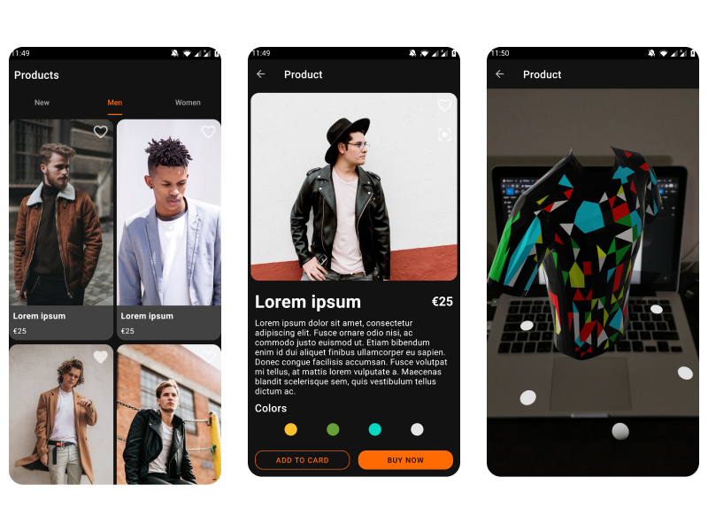

# Zalando AR

A clone of Zalando's app with an AR scene to view the product.

## Screenshots 📱

    

## Motivation 💪

The focus of this project is to learn how to use ARCore and Sceneform to create a great AR experience.

## Libraries Used 🛠

- [**AndroidImageSlider**](https://github.com/smarteist/Android-Image-Slider)
- [**Coil**](https://github.com/coil-kt/coil)
- [**Kotlin Coroutines & Flow**](https://github.com/Kotlin/kotlinx.coroutines)
- [**Kotlin Serialization**](https://github.com/Kotlin/kotlinx.serialization)
- [**Lifecycle**](https://developer.android.com/topic/libraries/architecture)
- [**LiveData**](https://developer.android.com/topic/libraries/architecture)
- [**mockk**](https://github.com/mockk/mockk)
- [**Room**](https://developer.android.com/topic/libraries/architecture)
- [**Timber**](https://github.com/JakeWharton/timber)
- [**Truth**](https://github.com/google/truth)
- [**ViewBinding**](https://developer.android.com/topic/libraries/architecture)
- [**ViewModel**](https://developer.android.com/topic/libraries/architecture)
- [**WorkManager**](https://developer.android.com/topic/libraries/architecture)

## Static Analysis 🔍

The project uses [**ktlint**](https://github.com/pinterest/ktlint) with the [ktlint-gradle](https://github.com/jlleitschuh/ktlint-gradle) plugin to format your code.

## CI ⚙️

There are currently the following workflows available:

- [Build and check](.github/workflows/build-and-check.yaml) - Will run the `build` and `check` task.

## Resources 💦

- [**AR obj**](https://poly.google.com/view/bdOMzzh-fSl)

## Contributing 🤝

Feel free to open a issue or submit a pull request for any bugs/improvements.
